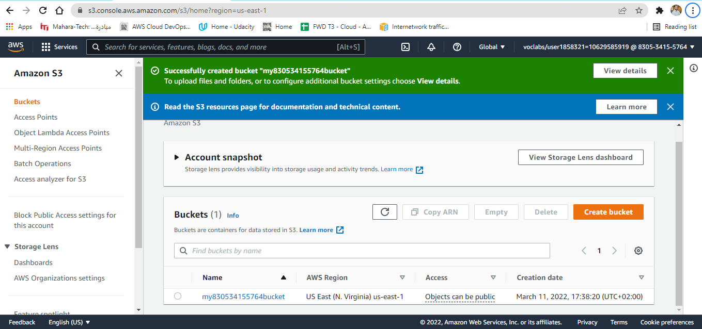
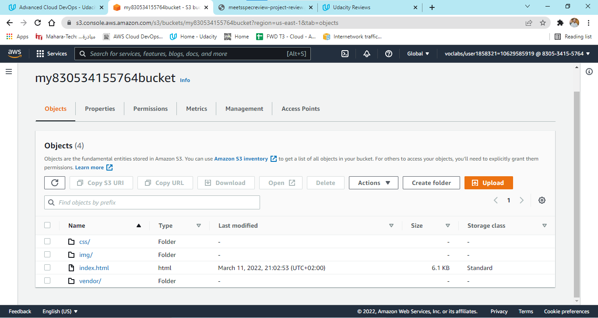
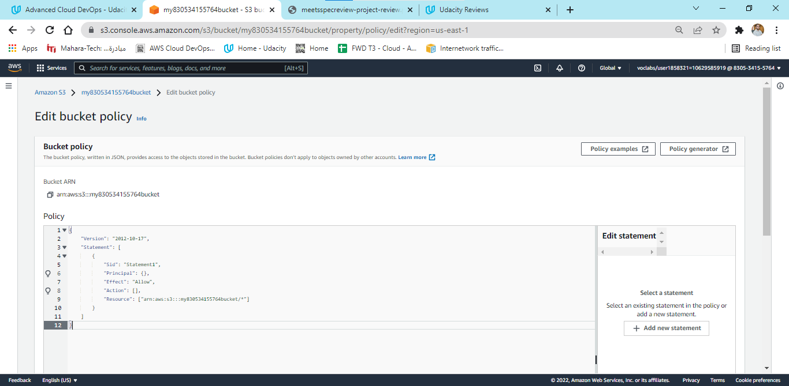
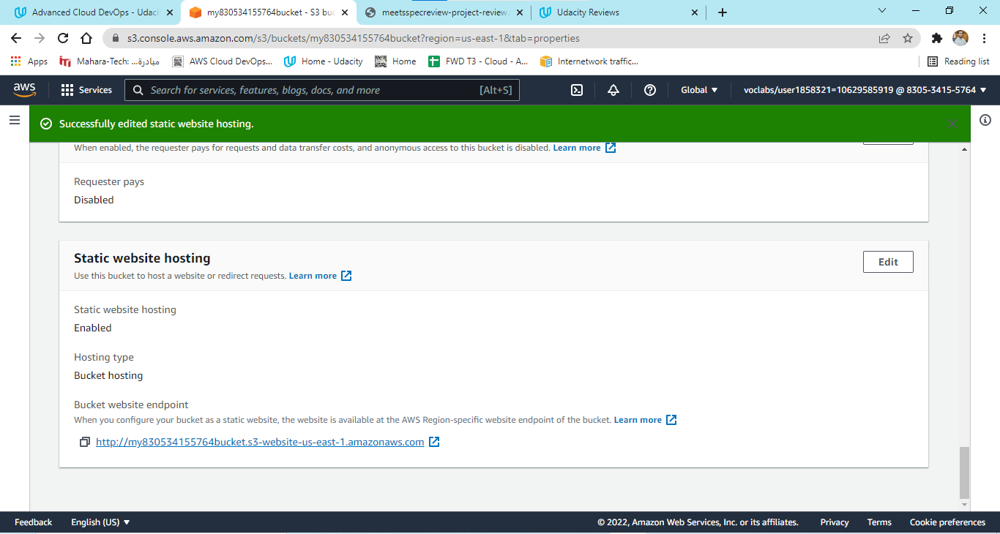
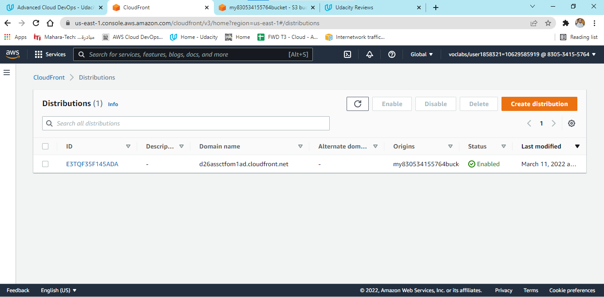
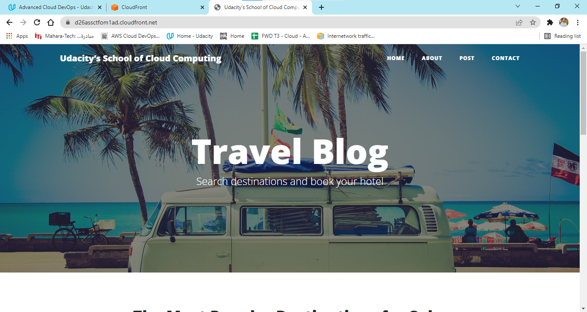

# Deploy-Static-Website-on-AWS

In this project, I deploy a static website to AWS by performing the following steps:

- I create a public S3 bucket and upload the website files to my bucket.

### 1- Create S3 Bucket

### 2- Upload files to S3 Bucket

- I configure the bucket for website hosting and secure it using IAM policies.

### 3- Secure Bucket via IAM policies

### 4- Configure S3 Bucket

- I speed up content delivery using AWS’s content distribution network service, CloudFront.

### 5- Distribute Website via CloudFront

- I access your website in a browser using the unique CloudFront endpoint.

### 6- Access Website in Web Browser(CloudFront endpoint URL)

